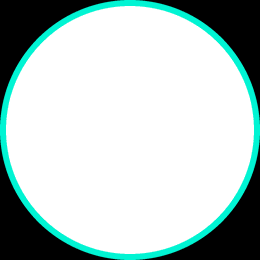

  

  

<h3 align="center">Building explainable AI systems, risk intelligence and full-stack products</h3>

  
  

---

### About Me

I'm **Devireddy Bharadwaja Reddy** — focused on **Applied AI, Machine Learning, and Full-Stack Development**. I like turning complex data and product ideas into measurable, explainable systems.

- Building at the intersection of **ML / Risk Intelligence / APIs / Product**
- Strong on **Python, JavaScript, System Design**
- Approach: **Build → Test → Measure → Ship**

---

### Tech Stack

---

### Featured Work

| Project | What it does | Stack |
|---|---|---|
| [**TRACER — Real-Time Mule-Ring Defense**](https://github.com/WHITEJACK5/TRACER-Real-Time-Mule-Ring-Defense) | Defense-only risk engine with XGBoost, SHAP, NetworkX graph detection and audit ledger | Python, FastAPI, Next.js |
| [**loan-default-risk**](https://github.com/WHITEJACK5/loan-default-risk) | Calibrated PD modeling, profit-aware policy, SHAP, A/B testing — [Demo](https://whitejack5-loan-default-risk.hf.space) | Python, LightGBM, MLflow |
| [**white-collars**](https://github.com/WHITEJACK5/white-collars) | Staged monorepo job portal with scraping and secure workflows | Node.js, Express, MongoDB |
| [**DYNAMIC-QR**](https://github.com/WHITEJACK5/DYNAMIC-QR) | Flask + SQLite QR generator with analytics | Python, Flask |

---

### GitHub Analytics

  

  
  

---

### Let's Connect

If you work on AI systems, risk tech, or product — let's talk.

**GitHub:** github.com/WHITEJACK5 · **LinkedIn:** linkedin.com/in/devireddybharadwaja

