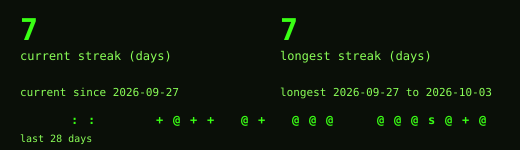
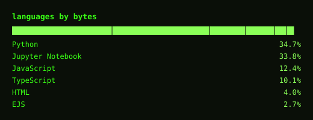
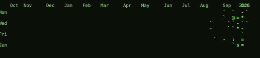

<div align="center">


<br/>


</div>

---


Applied AI engineer and full-stack builder. I turn messy data and product ideas
into systems that are measurable and explainable &mdash; fraud risk engines,
calibrated models, and the interfaces that make them usable.

I care about the parts that are easy to skip: reproducible evaluation, honest
model limits, and documentation that matches what the code actually does.

> A profile README is the one page where a broken image is most expensive.
> Every graphic below is generated inside this repository by a scheduled
> action. The page makes **zero** third-party requests.

---


<samp>Languages</samp> `Python` `JavaScript` `TypeScript` `Java` `SQL` `Bash`

<samp>AI / ML</samp> `XGBoost` `LightGBM` `SHAP` `scikit-learn` `MLflow` `NetworkX`

<samp>Backend</samp> `FastAPI` `Flask` `Node.js` `Express` `REST` `WebSocket`

<samp>Frontend</samp> `Next.js` `React` `Tailwind` `ReactFlow` `Mermaid` `Monaco`

<samp>Data</samp> `PostgreSQL` `MongoDB` `SQLite` `Prisma`

<samp>Platform</samp> `Docker` `GitHub Actions` `Turborepo` `pytest` `Vitest`

---


<details open>
<summary><b>&#9654; TRACER &mdash; Real-Time Mule-Ring Defense</b></summary>

<br/>

Defense-only risk engine scoring Razorpay transactions in under 50&nbsp;ms.
Graph topology catches what a row-wise model misses: devices fanning out across
payment identities, and same-amount repeat smurfing. A bounded agent can only
approve, challenge, or hold &mdash; and every action lands in a hash-chained
audit ledger.

<samp>Stack</samp> Python &middot; FastAPI &middot; Next.js &middot; XGBoost &middot; SHAP &middot; NetworkX
<br/>
<a href="https://github.com/WHITEJACK5/TRACER-Real-Time-Mule-Ring-Defense">Repository</a>

</details>

<details>
<summary><b>&#9654; loan-default-risk</b></summary>

<br/>

Probability-of-default modeling on LendingClub, with the leakage audit written
down: 151 raw columns reduced to 24 origination-time columns, and a temporal
split instead of a random one. Calibration and a profit-aware policy turn the
score into an approve/reject decision, and SHAP explains it.

<samp>Stack</samp> Python &middot; LightGBM &middot; MLflow &middot; SHAP &middot; FastAPI &middot; Docker
<br/>
<a href="https://github.com/WHITEJACK5/loan-default-risk">Repository</a> &middot; <a href="https://whitejack5-loan-default-risk.hf.space">Demo</a>

</details>

<details>
<summary><b>&#9654; white-collars</b></summary>

<br/>

Full-stack job portal that scrapes company career pages and lets applicants
apply in one click with saved documents. Deliberately staged &mdash; monolith,
then feature-based decomposition, then a Turborepo monorepo with OpenAPI
contracts &mdash; with the honest stopping point documented rather than faked.

<samp>Stack</samp> Node.js &middot; Express &middot; MongoDB &middot; EJS &middot; Turborepo &middot; Docker
<br/>
<a href="https://github.com/WHITEJACK5/white-collars">Repository</a>

</details>

<details>
<summary><b>&#9654; DYNAMIC-QR</b></summary>

<br/>

Local-first QR generator: 25+ payload types, static and dynamic codes, live
preview, password and expiry protection, and scan analytics on a local SQLite
database that initialises itself on first run.

<samp>Stack</samp> Python &middot; Flask &middot; SQLite &middot; JWT
<br/>
<a href="https://github.com/WHITEJACK5/DYNAMIC-QR">Repository</a>

</details>

---


| Domain | What I actually do |
| :-- | :-- |
| **Risk intelligence** | Mule-ring graph detection, calibrated risk scoring, threshold policy |
| **Explainable ML** | SHAP attribution, model cards, limitations stated next to the claims |
| **ML systems** | Leakage-aware validation, temporal splits, drift monitoring, reproducible pipelines |
| **Backend** | Typed REST APIs, idempotency, rate limiting, audit trails |
| **Product** | Next.js interfaces, dashboards, Docker delivery, CI that gates merges |

---


- **Reproducible evaluation before optimization.** A number you cannot re-derive
  is not a result.
- **Explainability is part of the model, not a wrapper.** If nobody can say why
  a transaction was held, the score is not usable.
- **Document the limits.** A prototype that admits its own failure modes is
  more useful than one that overstates its accuracy.
- **Small, testable slices.** A change that can be reviewed is a change that
  can be trusted.

---


<br/>



<br/>



<br/>



<br/>

<sub>Refreshed nightly by <code>.github/workflows/refresh-stats.yml</code> from the GitHub
GraphQL API, pinned to whole UTC days so the output is byte-stable. Columns, not
lines: a day with no contributions is empty space, not a point on a curve
between neighbours.</sub>

---


<div align="center">

<a href="https://github.com/WHITEJACK5"></a>
<a href="https://www.linkedin.com/in/devireddybharadwaja"></a>

<br/><br/>


</div>

---

## How this page is built

Everything graphical here is generated by scripts in this repository.

```bash
python scripts/portrait.py        # portrait.svg   - ASCII + SMIL typing
python scripts/generate_stats.py  # *.svg         - GraphQL, stdlib only
python scripts/headings.py        # hd/*.svg      - section headings
python scripts/build_fonts.py     # fonts/*.woff2 - subsets, ~10 KB total
```

| Piece | How |
| :-- | :-- |
| Portrait | `rembg` cut-out &rarr; bilateral &rarr; CLAHE &rarr; darkening curve &rarr; ramp |
| Type animation | SMIL `clipPath` wipe, rows staggered, `fill="freeze"` so it prints once |
| Stats | GitHub GraphQL, window pinned to whole UTC days, repos filtered to `PUBLIC` |
| Fonts | JetBrains Mono (SIL OFL) subset per role, inlined as woff2 data URIs |

GitHub strips `<style>`, `class`, and inline `<svg>` from README markdown, so
the font is embedded in each SVG and the only text styling available in the
body is `code` / `samp`. Image headings have no anchor links, so the on-page
README outline is empty &mdash; the `alt` text carries the word for screen
readers.

Portrait pipeline adapted from the
[ASCII Portrait README Guide](https://burly-handstand-0dc.notion.site/ASCII-Portrait-README-Guide-3a3e3f86338481f0b545ec8120bbf604).
Typeface: JetBrains Mono, SIL OFL 1.1.
